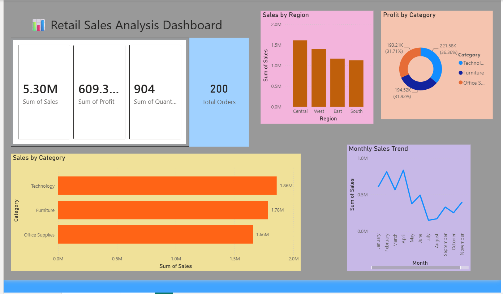

# 📊 Retail Sales Analysis Dashboard

## 📌 Project Overview
This project analyzes retail sales data using Python, SQL, and Power BI. The objective is to identify sales trends, profit performance, customer segments, and regional performance to support business decision-making.

---

## 🛠️ Tools & Technologies
- Python
- Pandas
- NumPy
- Matplotlib
- SQL (SQLite)
- Power BI
- Google Colab
- Git & GitHub

---

## 📂 Dataset
- Retail Superstore Sales Dataset
- Total Orders: 200
- Sales: 5.30M
- Profit: 609.31K

---

## 📈 Dashboard Features
- Total Sales KPI
- Total Profit KPI
- Total Quantity KPI
- Total Orders KPI
- Sales by Category
- Sales by Region
- Monthly Sales Trend
- Profit by Category
- Interactive Slicers (Region, Category, Segment, Date)

---

## 🔍 Key Insights
- Technology generated the highest sales.
- West region contributed significantly to revenue.
- Monthly sales trends help identify seasonal demand.
- Interactive filters allow dynamic business analysis.

---

## 📷 Dashboard Preview

---

## 👩‍💻 Author
**Pragya Pal**
